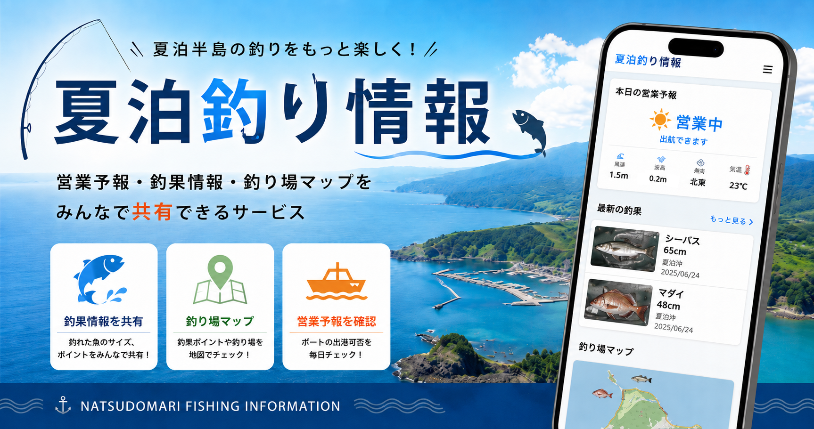
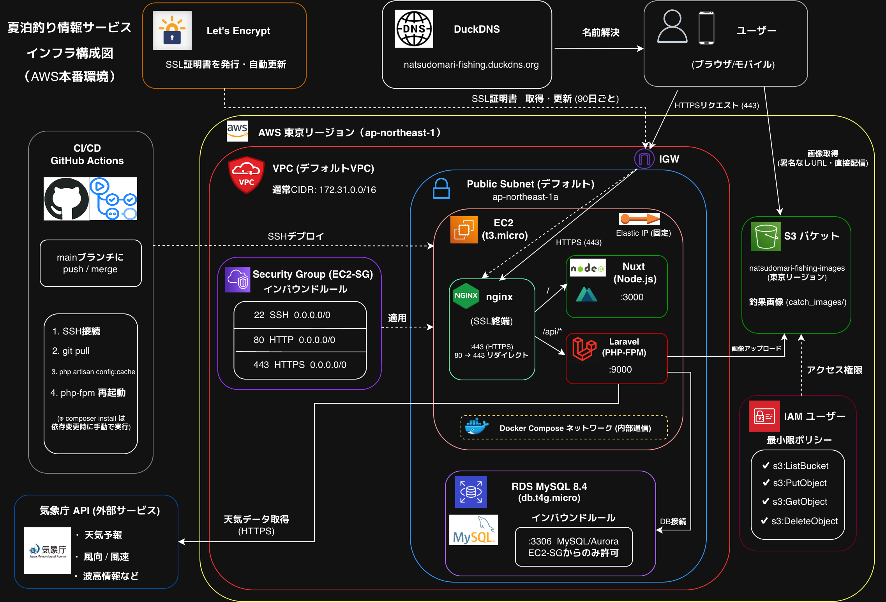
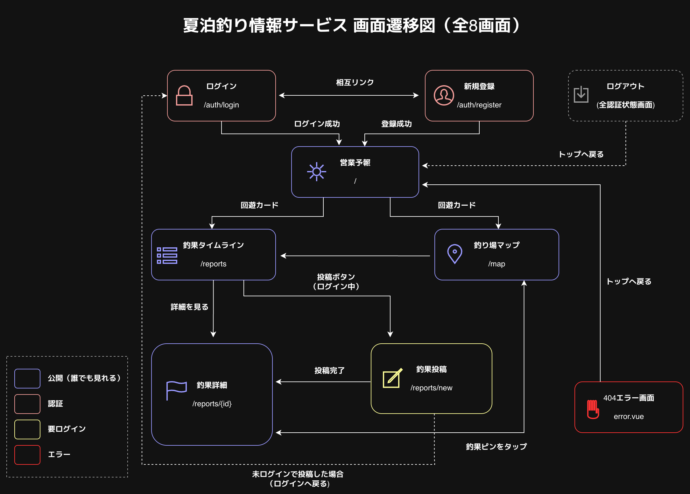
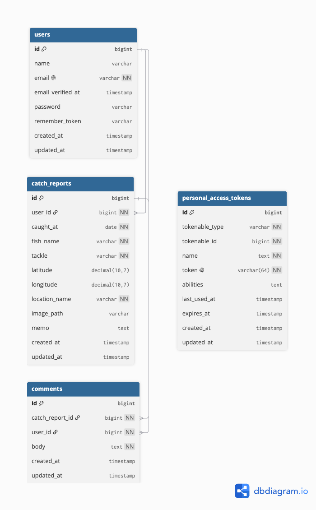
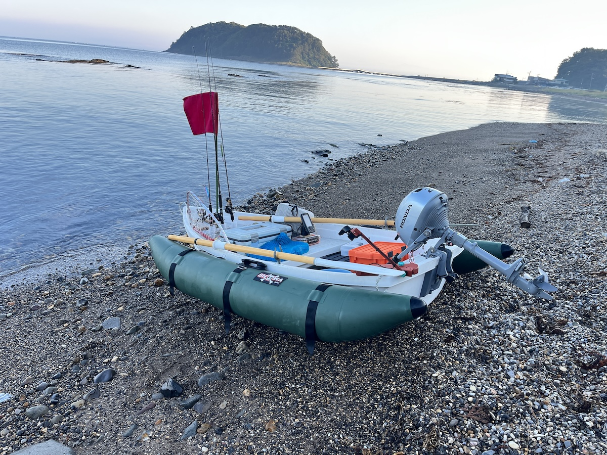

# 夏泊釣り情報サービス

[](https://github.com/kazuki-cat/natsudomari-fishing/actions/workflows/ci.yml)

サービスURL: https://natsudomari-fishing.duckdns.org



### 夏泊半島のレンタルボート営業を予報し、釣果を共有できるアプリ

青森県・夏泊半島ではレンタルボートで海釣りが楽しめますが、ボートの営業可否は当日の天気・波・風に左右され、当日まで営業しているか分かりません。

本サービスは気象庁のデータをもとに営業の可能性を予報し、あわせて釣果を共有できる夏泊半島専用のサービスです。

**【ゲストユーザー情報】**

「ゲストでログイン」ボタンから、登録不要で釣果投稿・コメントをお試しいただけます。

## 開発背景

私は青森県に住んでおり、夏泊半島のレンタルボートでよく釣りをしています。しかし、このレンタルボートの営業は当日にならないと営業しているか分かりません。
その日の天気・波・風などの条件が悪いと、安全のために営業しないためです。

私自身、前日から釣りの準備をし、1時間半かけて当日現地に向かったのに、営業しておらず悔しい思いを何度もしました。周りにも同じ経験をした人が多くいます。

この「当日行くまで営業しているか分からない」という課題を解決したいと思い、気象庁のデータをもとに夏泊半島専用の営業を予報するサービスを作りました。
あわせて、夏泊半島周辺で「いつ・どこで・何が釣れているか」を共有できる釣果投稿機能も組み込み、釣り人同士で情報交換できるようにしました。

## 主な機能

- **営業予報** - 気象庁データから風速・波高を判定し、当日の営業の可能性を「高・中・低」で表示。週間天気予報も確認できる
- **釣果投稿** - 魚種・仕掛け・釣り場名をドロップダウンで選択、地図でピン指定・写真アップロード・詳細をメモ
- **釣果タイムライン** - 投稿された釣果を一覧表示。魚種・仕掛け・釣り場名で絞り込み、釣れた日順に並び替え
- **釣り場マップ** - 釣果を地図上に魚種アイコンで表示。アイコンクリックで詳細へ。魚種・仕掛け・年・月で絞り込み
- **コメント** - 釣果投稿へのコメントで釣り人同士が情報交換
- **ゲストログイン** - 登録不要で投稿・コメントをお試し可能

## 技術スタック

| カテゴリ | 技術 |
| --- | --- |
| フロントエンド | Nuxt 4.4.8 / Vue 3.5.38 / TypeScript |
| バックエンド | PHP 8.4 / Laravel 13.15 |
| 認証 | Laravel Sanctum 4.3(APIトークン認証) |
| データベース | MySQL(開発: 8.0 / 本番: RDS 8.4) |
| 地図 | Leaflet 1.9.4 / OpenStreetMap |
| 天気データ | 気象庁API |
| スタイリング | TailwindCSS 3.4 |
| ストレージ | 画像保存(開発: ローカルストレージ / 本番: Amazon S3) |
| インフラ | AWS EC2 / RDS / S3 ・Nginx・DuckDNS + Let's Encrypt(HTTPS) |
| 開発環境 | Docker / Docker Compose |
| CI/CD | GitHub Actions(テスト+Pint) / Dependabot / appleboy ssh-action |
| 開発フロー | GitHub Rulesets(ブランチ保護) / 1機能 = 1 Issue・1 PR |
| その他 | Opcache(本番PHP高速化) / GD(画像処理) / Certbot(HTTPS自動更新) / Prettier(コード整形) |


## 技術選定理由

### 【フロントエンド】Nuxt / Vue / TypeScript

先に学習していたLaravelが公式でVue.jsを推奨していたため、連携のしやすさからVueを選びました。フレームワークには、ファイルベースのルーティングや自動インポートで開発を効率化できるNuxtを採用しています。TypeScriptは、釣果や天気など多くのプロパティを持つデータを扱う際に、型による補完とエラーの事前検知でバグを防げるため導入しました。

### 【バックエンド】PHP / Laravel

Laravelの「設定より規約」という原則により、細かい設定を減らして効率的に開発できると考え採用しました。本アプリでは、ORM(Eloquent)による直感的なDB操作、リクエストのバリデーション、ルートモデルバインディングによる自動的なデータ取得などを活用し、釣果投稿・認証・コメントなどの機能を効率的に実装しました。

### 【データベース】MySQL

本アプリでは「ユーザー」を中心に、釣果・コメントといった関連データを扱います。これらをリレーショナルに管理でき、AWS RDSで本番運用しやすいMySQLを採用しました。開発環境(Docker)と本番(RDS)で同じMySQLを使うことで、環境差による不具合を防いでいます。

### 【認証】Laravel Sanctum

フロントエンド(Nuxt)とバックエンド(Laravel)が分離した構成のため、Laravel公式のSanctumによるトークン認証(Bearer)を採用しました。ログイン時に発行したトークンをCookieに保存し、API通信時に自動でAuthorizationヘッダーへ付与する仕組みにしています。サーバー側にセッションを持たないため、API主体の本アプリの構成に適しています。

### 【地図】Leaflet / OpenStreetMap

地図機能には、無料かつAPIキーが不要なLeaflet(地図表示ライブラリ)とOpenStreetMap(地図データ)を採用しました。Google Maps APIのような利用料金が発生しないため、コストをかけずに地図機能を実装できます。釣果を魚種ごとのアイコンで表示したり、投稿時に地図をクリックして釣れた場所のピンを立てるなど、用途に応じて使い分けています。

### 【天気】気象庁API

営業予報には、無料かつAPIキーが不要な気象庁APIを採用しました。天気・風・波などの海上データが取得でき、本アプリの「風速・波高からボートの営業可否を判定する」機能に必要な情報を用意できる点も決め手です。

### 【スタイリング】TailwindCSS

CSSを別ファイルに書かず、HTML上でクラスを指定して直接スタイリングできるTailwindCSSを採用しました。クラス名を自分で考える必要がなく、統一感を保ちながら効率的にUIを実装できます。

### 【環境構築】Docker

開発環境をコンテナ化することで、OSなどの環境に依存せず、どこでも同じ環境を再現できるDockerを採用しました。また、開発環境と本番用で構成を分けられるため、開発時はホットリロードを有効に、本番はOpcacheを有効にするなど、それぞれに最適な設定で運用しています。

### 【インフラ】AWS (EC2 / RDS / S3)

学習したAWSを実践する目的で、本番環境をAWS上に構築しました。サーバー(EC2)・データベース(RDS)・画像ストレージ(S3)と役割ごとにサービスを分け、データをEC2の外に切り出しています。これにより、サーバーを作り直してもデータが失われないステートレスな構成にしています。

### 【CI/CD】GitHub Actions

テストとデプロイを自動化し、開発を効率化するためにGitHub Actionsを導入しました。コードをpushするたびにテストとコード整形チェック(Pint)が自動で実行され、mainブランチにマージされると本番環境へ自動でデプロイされます。

## インフラ構成図



本番環境はAWS上に構築しています。Nginxがリバースプロキシとして、APIリクエストをLaravel(PHP-FPM)へ、それ以外をNuxtのSSRサーバーへ振り分けます。データベースはRDS、画像はS3に分離し、EC2をステートレスに保っています。HTTPSはDuckDNSとLet's Encryptで無料で構築し、証明書はCertbotで自動更新しています。

## 画面遷移図



未ログインでも閲覧できる画面と、ログインが必要な画面を分けて設計しています。

## ER図



users・catch_reports・comments の3テーブルを中心に、外部キーで関連付けています。認証トークンはSanctum標準のpersonal_access_tokensテーブルで管理しています。

## API設計書

エンドポイントの一覧やリクエスト・レスポンスの仕様は、以下にまとめています。

 - [API設計書(docs/api-design.md)](docs/api-design.md)

## ディレクトリ構成

主要なディレクトリとファイルの構成は以下の通りです。

```
natsudomari-fishing/
  ├── .github/workflows/                # CI/CD（ci.yml / deploy.yml）
  ├── backend/                          # Laravel（API）
  │   ├── app/
  │   │   ├── Http/Controllers/       # API（認証・釣果・コメント・天気）
  │   │   ├── Models/                 # Eloquentモデル（User・CatchReport・Comment）
  │   │   └── Services/               # 天気データの取得・加工（WeatherService）
  │   ├── database/
  │   │   ├── migrations/             # テーブル定義
  │   │   ├── factories/              # テスト用データ生成
  │   │   └── seeders/                # デモデータ投入
  │   ├── routes/api.php               # APIルート定義
  │   ├── tests/                       # テスト（Feature / Unit・計30本）
  │   └── lang/ja/                     # バリデーションメッセージ日本語化
  ├── frontend/                         # Nuxt（SPA）
  │   ├── app/
  │   │   ├── pages/                  # 各画面（index / reports / map / auth）
  │   │   ├── components/             # UIコンポーネント（catch / layout / weather）
  │   │   ├── composables/            # 状態管理・ロジック（useAuth など）
  │   │   ├── middleware/             # 認証ガード（auth / guest）
  │   │   ├── layouts/                # 共通レイアウト
  │   │   ├── plugins/                # リロード時のログイン復元（auth.client）
  │   │   └── types/                  # TypeScript型定義
  │   └── nuxt.config.ts               # Nuxt設定（OGP・モジュール等）
  ├── docker/                           # コンテナ設定
  │   ├── nginx/                       # リバースプロキシ（開発用・本番用）
  │   ├── php/                         # PHP-FPM・Opcache設定
  │   └── node/                        # Nuxt（開発・本番ビルド）
  ├── docs/                             # 設計ドキュメント・各種図
  ├── docker-compose.yml                # 開発用
  └── docker-compose.prod.yml           # 本番用（RDS / Opcache）
```

## こだわった実装

こだわった実装は以下の機能です。

- 営業予報機能
- 釣り場マップ機能
- 画像アップロード・配信機能
- 開発・本番環境の構築

### 営業予報機能

気象庁APIから取得した天気データをもとに、ボートの営業可否を「高・中・低」で自動判定します。

気象庁のデータは「南の風 やや強く」のようなテキストで返るため、バックエンドで風速(m/s)に変換しています。

```php
// WeatherService.php(風テキストから風速を推定)
public function estimateWindSpeed(string $windText): float
{
  // 「やや強く」は「強く」を含むため、先に判定する
  if (str_contains($windText, 'やや強く')) {
    return 5.0;
  }
  if (str_contains($windText, '強く')) {
    return 8.0;
  }
  return 3.0;
}
```

この風速と波高をフロントエンドで判定し、営業の可能性を3段階で表示します。

```ts
// useWeather.ts(風速・波高から営業可否を判定)
const operationStatus = computed(() => {
  const wind = weather.value.windSpeed;
  const wave = weather.value.waveHeightValue;
  if (wave > 1 || wind >= 6) return "low";      // 波1m超 or 風速6m/s以上 → 低
  if (wave > 0.5 || wind >= 3) return "medium"; // 波 0.5m超 or 風速3m/s以上 → 中
  return "high";                                // それ以外 → 高
});
```

### 釣り場マップ機能

投稿された釣果を、魚種ごとのアイコンで地図上に表示します。

魚種・仕掛け・年・月で絞り込めますが、サーバーへ再リクエストせず、取得済みのデータをフロントエンドで瞬時にフィルタリングしています。

```ts
// map.vue(取得済みの釣果を、選択条件で絞り込む)
const filteredReports = computed(() => {
  return reports.value.filter((r) => {
    if (filterFish.value && r.fish_name !== filterFish.value) return false;
    if (filterTackle.value && r.tackle !== filterTackle.value) return false;
    // 年・月でも絞り込み
    return true;
  });
});
```

絞り込み条件が変わるたびに地図を再生成するため、地図コンポーネントに`:key`を指定し、ピンの再描画を制御しています。

```vue
<!-- map.vue(条件が変わるとmapKeyが変わり、地図が再描画される)-->
<CatchMap :key="mapKey" :reports="filteredReports" />
```

### 画像アップロード・配信機能

釣果の画像は、開発環境ではローカルディスク、本番環境ではAmazon S3に保存しています。

保存先をコードに直接書かず、`.env`の設定で切り替えられるようにしているため、環境ごとにコードを変える必要がありません。

```php
// CatchReportController.php(保存先を固定せず、デフォルトディスクに保存)
$imagePath = $request->file('image')->store('catch_images');
```

画像のURLも、保存先に応じて自動で組み立てられます。

```php
// CatchReport.php(image_pathから表示用の完全URLを返すアクセサ)
public function getImageUrlAttribute(): ?string
{
  return $this->image_path
    ? Storage::url($this->image_path) // 開発はローカル、本番はS3のURLを返す
    : null;
}
```

### 開発・本番環境の構築

開発環境と本番環境で、Dockerの構成ファイルを分けています。

本番(`docker-compose.prod.yml`)ではDBコンテナを使わずRDSに接続し、PHPのOpcacheを有効にして高速化しています。

```ini
; opcache.ini(本番のみ適用してOpcacheを有効化)
opcache.enable=1
; ファイルの更新チェックをしない(本番はコードが変わらないため)
opcache.validate_timestamps=0
```

## エラー処理・セキュリティ対策

### パスワードとメールアドレスの漏洩防止

釣果一覧では投稿者の名前を表示しますが、APIレスポンスにパスワードやメールアドレスが含まれると第三者に漏れてしまいます。そのため、Userモデルの`$hidden`にパスワードやメールアドレスを指定し、APIレスポンスに含まれないようにしています。

```php
// User.php(password・emailなどをAPIレスポンスから除外)
protected $hidden = [
  'password',
  'remember_token',
  'email',
];
```

### レート制限(throttle)

ログインや投稿などのAPIにLaravelのthrottleでレート制限をかけ、総当たり攻撃や連投スパムを防いでいます。

```php
// routes/api.php(ログインは1分6回、投稿は1分20回まで)
Route::post('/login', [AuthController::class, 'login'])->middleware('throttle:6,1');
Route::post('/reports', [CatchReportController::class, 'store'])->middleware('throttle:20,1');
```

### 外部API失敗時のフォールバック

天気データは外部の気象庁APIに依存するため、取得に失敗してもアプリが落ちないよう、タイムアウトとtry-catchでフォールバック(代用データ)を返しています。

```php
// WeatherService.php(10秒でタイムアウト・失敗時はフォールバックを返す)
try {
  $response = Http::timeout(10)->get($url);
  if (! $response->successful()) {
    return $this->fallback();
  }
  // ...
} catch (\Exception) {
  return $this->fallback();
}
```

### その他のセキュリティ対策

- 釣果の削除は投稿者本人のみ許可
- パスワードはハッシュ化して保存
- 本番環境ではデバッグ表示を無効化
- すべての入力にバリデーションを実施
- 画像アップロードは形式・サイズを制限
- 認証が必要なAPIはSanctumのミドルウェアで保護

## テスト

バックエンドのAPIに対して、PHPUnitでFeatureテストとUnitテストを実装しています(計30本)。テスト用のDBにはSQLite(インメモリ)を使い、各テストごとにデータベースをリセットすることで、テスト間で影響が出ないようにしています。

- **Featureテスト** - 認証・釣果・コメント・天気APIの動作(登録 / ログイン / 投稿 / 削除 / 権限など)
- **Unitテスト** - WeatherServiceの気象データ加工ロジック(風速の推定 / 波高の数値変換 / 風向きの抽出など)

```bash
# テスト実行
docker compose exec php php artisan test
```

## CI/CD・開発フロー

GitHub Actionsで、開発からデプロイまでを自動化しています。開発は「1機能 = 1 Issue ・ 1 PR」を基本とし、Issueで作業内容を整理してからブランチを切り、プルリクエスト経由でmainにマージしています。

- **CI** - push・プルリクエストのたびに、テストとコード整形チェック(Pint)を自動実行
- **CD** - mainブランチへのマージで、本番環境(EC2)へ自動デプロイ
- **Dependabot** - 依存パッケージの更新を自動でプルリクエスト
- **ブランチ保護(Rulesets)** - テストが通らないとmainにマージできないように制限

## ローカル環境構築

```bash
# リポジトリを取得
git clone https://github.com/kazuki-cat/natsudomari-fishing.git
cd natsudomari-fishing

# コンテナを起動(初回はビルドされる)
docker compose up -d --build

# バックエンドのセットアップ
docker compose exec php composer install
docker compose exec php cp .env.example .env
docker compose exec php php artisan key:generate
docker compose exec php php artisan migrate --seed
docker compose exec php php artisan storage:link
```

- フロントエンド: http://localhost
- API: http://localhost/api

> フロントエンド(Nuxt)の依存インストールと起動は、nodeコンテナ起動時に自動で実行されます。

## 作者

### Kazuki Toshinai

青森県で生まれ育った、駆け出しエンジニアです。未経験から独学でWeb開発を学んでいます。

最初はシンプルなアプリのつもりが、「どうせならAWSで動かしたい」「テストもCI/CDも実務みたいにやりたい」と学びながら一つずつできることを広げていきました。

まだ未熟ですが、知らないことを調べて形にするのが楽しくて仕方ありません。地元青森のIT企業で成長しながら、地域に貢献していけるように頑張ります。



GitHub: [@kazuki-cat](https://github.com/kazuki-cat)
